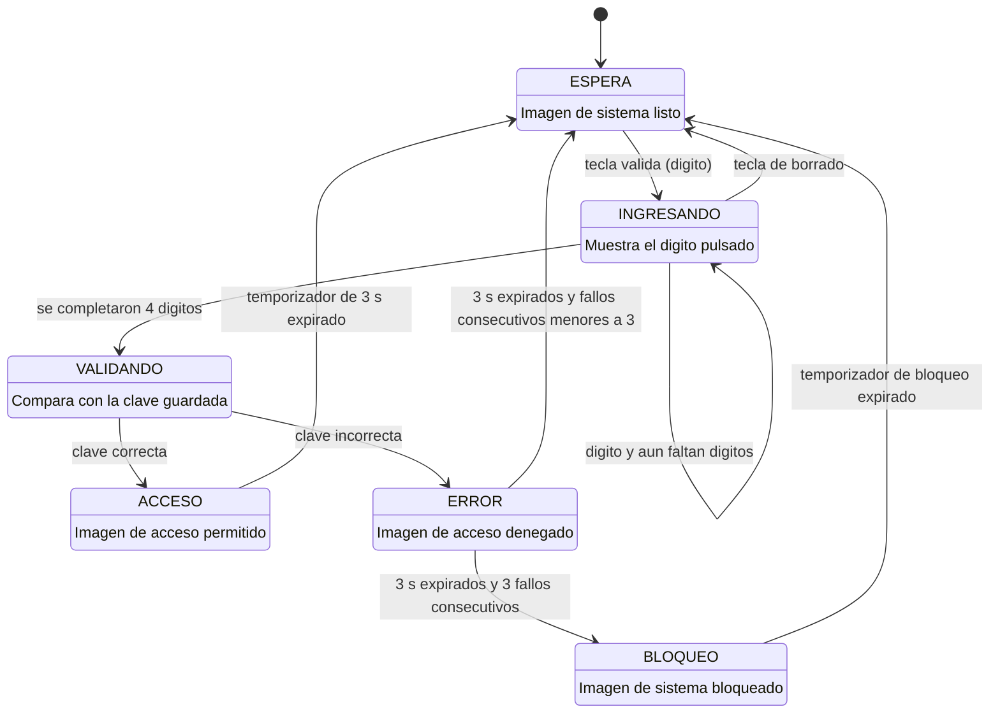

# Sistema de Acceso en C-Bare Metal

---
Autor: Gildardo E. Restrepo Duque.
Curso: Microcontroladores.
Semestre-curso: 2026-02

---
## Descripción

Consiste en un sistema básico de validación y control de accesos, desarrollado en C-Bare Metal sobre el microcontrolador **STM32F407VET6**.
Se ingresa una contraseña de 4 dígitos mediante teclado matricial 4x4 y cuya información es presentada en una matriz de leds 8x8.
El programa debe validar si una contraseña ingresada es o no correcta y retornar una imagen respectiva en la matriz de leds como validación.
La arquitectura del proyecto se consolida a partir de tres coneptos clave trabajados en las últimas clases del curso: Máquinas de Estados Finitas (`MEF`), Multiplexación y Programación Bare-Metal mediante acceso a registros.

---

## Estado de proyecto
>  En proceso

---

## Entornos
- STM32Cube IDE 2.2.0.
- STM32CubeProgrammer.
- STM32F407VET6.
- Matriz de leds 8x8.
- Teclado matricial 4x4.

---

## Arquitectura del proyecto
Sistema **cooperativo y no bloqueante**: `SysTick` genera una base de
tiempo de **1 ms** y el `while(1)` despacha en cada tick, y en orden fijo, todas
las máquinas de estados. Ninguna función espera y  ningún `delay` bloquea.
- **Teclado**: multiplexación **IN-OUT**, una fila por tick → barrido completo en 8 ms.
- **Matriz LED**: multiplexación **OUT-OUT**, una fila por tick → refresco a **125 Hz**.
- **Comunicación entre MEF**: solo por **eventos** (`KeyEvent_t`) y por consultas
  de estado. Ninguna máquina lee variables internas de otra.

Cadena de responsabilidad: `DRIVER → EVENTO → LÓGICA DE APLICACIÓN → DISPLAY`.

### Máquina de estados general



> [!note] Sobre los temporizadores
> Los 3 s y el tiempo de bloqueo se implementan con temporizadores software
> comparados contra el contador de milisegundos de `SysTick`. Durante toda la
> espera el sistema sigue multiplexando la matriz y barriendo el teclado.

El diagrama de arquitectura de módulos y los diagramas de estado de **cada una**
de las máquinas (barrido del teclado, antirrebote, multiplexado de la matriz y
máquina maestra) están en [`_docs/architecture.md`](_docs/architecture.md).

---

## Etapas de desarrollo

- [x] **Fase 0** — Infraestructura: estructura del repositorio, documentación base.
- [x] **Fase 1** — Base de tiempo: `SysTick` a 1 ms, capa de acceso a GPIO por registros y parpadeo del LED D2. Valida toolchain y flasheo.
- [x] **Fase 2** — Driver de la matriz LED 8x8 y MEF de multiplexado OUT-OUT. Se determina la polaridad real de la matriz.
- [x] **Fase 3** — Driver del teclado 4x4 y MEF de barrido IN-OUT.
- [x] **Fase 4** — MEF de antirrebote y contrato de eventos entre módulos.
- [x] **Fase 5** — MEF de sistema/contraseña y temporización no bloqueante de 3 s.
- [ ] **Fase 6** — MEF maestra, integración final y limpieza de código.
- [ ] **Fase 7** — Reto adicional: bloqueo temporal tras 3 intentos fallidos.
- [ ] **Fase 8** — Documentación de entregables y registro del uso de IA.

---

## Estructura del repositorio

```
_docs/          -> documentación del proyecto (.md, sobre plantilla común)
_references/    -> datasheets, esquemáticos y pinouts
inc/            -> headers de los módulos (.h), un archivo por responsabilidad
src/            -> código fuente de los módulos (.c), un archivo por responsabilidad
.gitignore
LICENSE
README.md
```


Módulos previstos en `src/` e `inc/`:

| Módulo | Responsabilidad |
|---|---|
| `board` | Mapa de pines y constantes de la placa. Punto único de configuración de hardware. |
| `gpio` | Capa mínima de acceso a GPIO por registros (`MODER`, `OTYPER`, `PUPDR`, `IDR`, `BSRR`). |
| `timebase` | `SysTick` a 1 ms, contador de milisegundos y temporizadores software no bloqueantes. |
| `keypad` | Driver del teclado 4x4 y MEF de barrido IN-OUT. |
| `keypad_fsm` | MEF de antirrebote. Emite un único evento por pulsación. |
| `led_matrix` | Driver de la matriz 8x8 y MEF de multiplexado OUT-OUT. |
| `images` | Mapas de bits constantes (`uint8_t[8]`): espera, dígitos, acceso, error, bloqueo. |
| `password` | Clave almacenada, buffer de ingreso y comparación. |
| `system_fsm` | MEF de la aplicación: ingreso, validación y temporización de resultados. |
| `main` | MEF maestra: inicialización y despacho cooperativo en el `while(1)`. |

---

## Cómo reproducir usando el pipeline IDE -> Programmer

### 1. Crear el proyecto en STM32CubeIDE

Abrir CubeIDE con un workspace **fuera de este repositorio**. Después
`File > New > STM32 Project` → seleccionar **STM32F407VETx** → *Targeted Language*
**C**, *Targeted Binary Type* **Executable**, *Targeted Project Type* **Empty**.
### 2. Vincular el código del repositorio

Añadir `src/` e `inc/` como **carpetas vinculadas**
### 3. Habilitar la salida `.hex`
`Properties > C/C++ Build > Settings > MCU/MPU Post build outputs` → marcar
**Convert to Intel Hex file**. Por defecto CubeIDE solo genera.
### 4. Compilar y flashear
1. **Build** en CubeIDE → se genera el `.hex` en `Debug/`.
2. **STM32CubeProgrammer** con el ST-Link: cargar el `.hex` en la dirección base
   `0x08000000` y programar.
3. Reset físico de la placa.

---
## Contacto
```
gildardo.restrepo@upb.edu.co
```

---

## Enlaces
[[proyectos|Proyectos Electrónica]]
