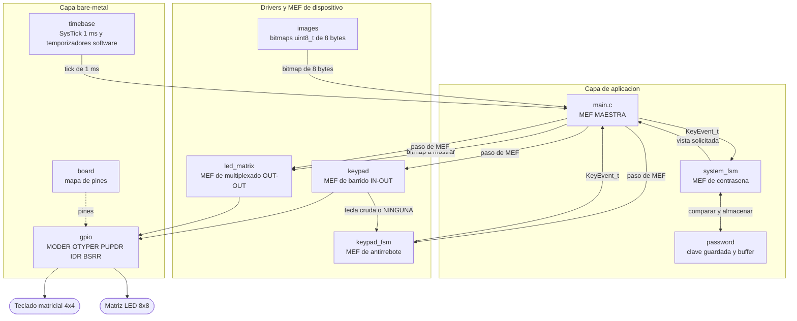
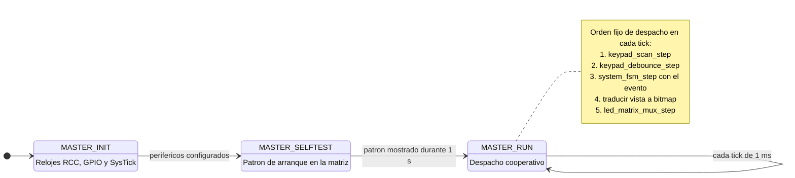
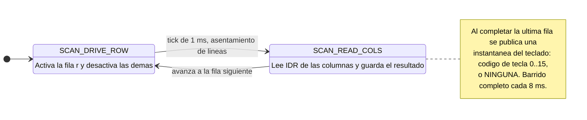
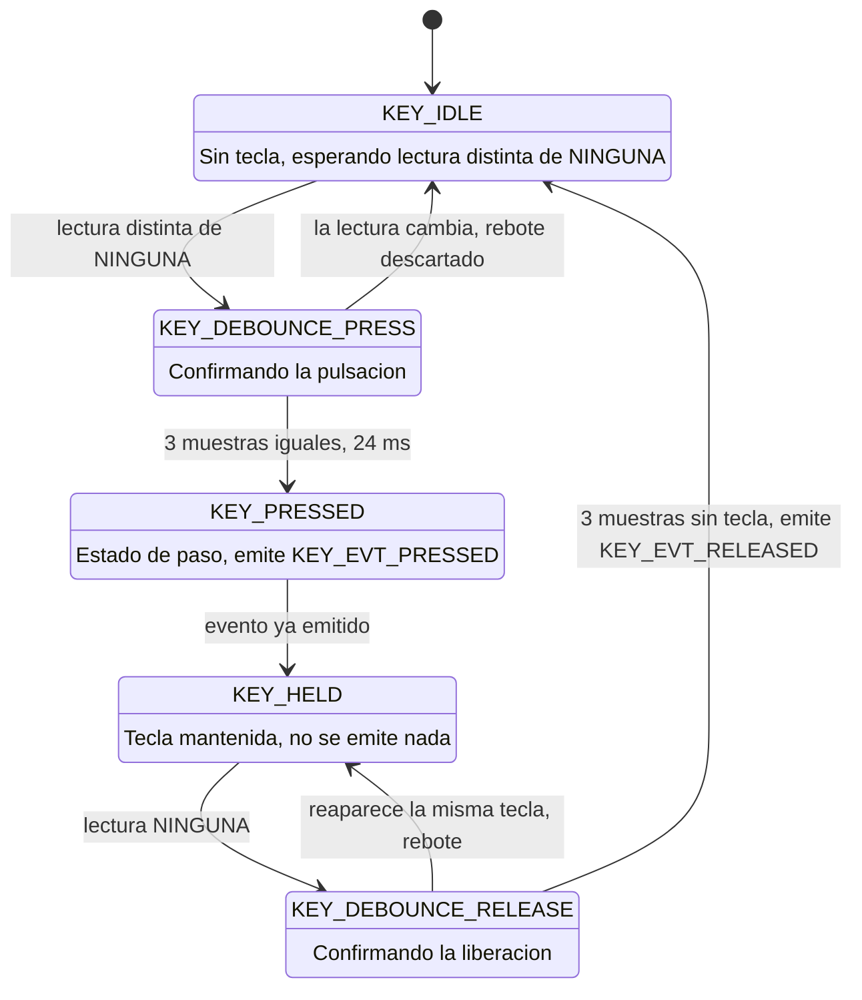
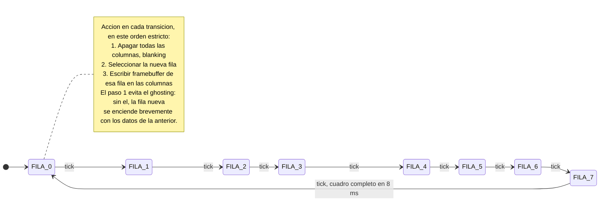
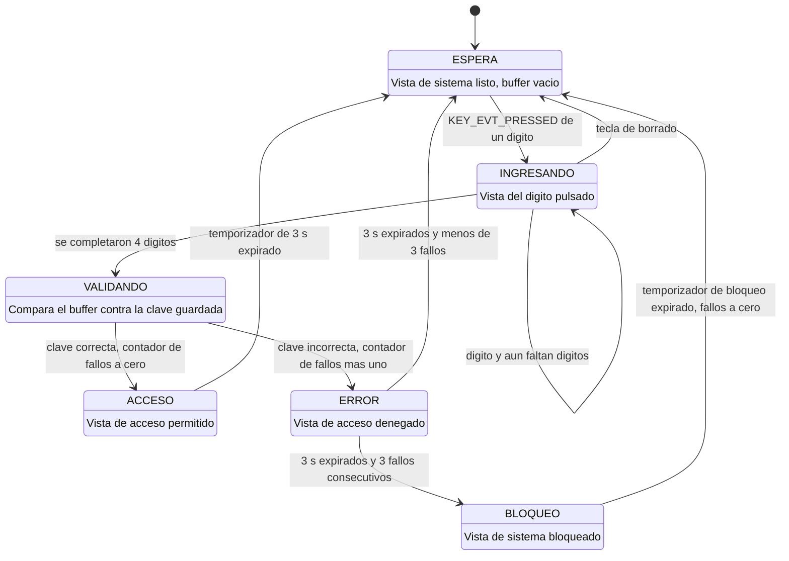

# Arquitectura del sistema

> [!success] Resumen
> Arquitectura del sistema de control de acceso en C bare-metal sobre STM32F407VET6.
> Reúne el diagrama de módulos, el modelo de tiempo cooperativo, el contrato de
> comunicación entre máquinas de estados y el diagrama de estados de **cada una**
> de las cinco MEF del proyecto.

---

## 1. Principio de diseño

Todo el sistema descansa sobre una única decisión: **nada bloquea**.

`SysTick` genera una base de tiempo de **1 ms**. Su rutina de interrupción hace
lo mínimo posible (incrementar el contador de milisegundos y levantar una
bandera). Todo el trabajo real ocurre en el `while(1)`, que en cada tick despacha
las máquinas de estados **en orden fijo**. Cada MEF ejecuta *un paso* y devuelve
el control inmediatamente.

Consecuencias directas:

- No existe ningún `delay_ms()` ni ningún bucle de espera en el proyecto.
- Los tiempos largos (antirrebote, 3 s de resultado, bloqueo) se miden con
  **temporizadores software**: se guarda una marca de tiempo y se compara contra
  el contador de milisegundos. Mientras tanto el resto del sistema sigue vivo.
- La matriz se sigue multiplexando durante los 3 s de la imagen de resultado,
  que es exactamente lo que exige el enunciado.

---

## 2. Diagrama de arquitectura



> [!important] Regla de acoplamiento
> Las flechas de datos son **eventos y valores de retorno**, nunca variables
> globales compartidas. Ninguna MEF lee el estado interno de otra: el teclado no
> sabe qué es una contraseña y la MEF de contraseña no sabe qué es un GPIO.

---

## 3. Modelo de tiempo

Presupuesto por tick de 1 ms:

| Tarea | Cadencia | Resultado |
|---|---|---|
| Multiplexado de la matriz | 1 fila por tick | Cuadro completo cada 8 ms, es decir **125 Hz**, sin parpadeo perceptible |
| Barrido del teclado | 1 semifase por tick | Barrido completo cada 8 ms (4 filas por 2 fases) |
| MEF de antirrebote | 1 paso por barrido completo | 3 muestras estables, es decir **24 ms** de antirrebote |
| MEF de contraseña | 1 paso por tick | Reacciona en menos de 1 ms al evento de tecla |
| Temporizador de resultado | comparación contra el contador de ms | 3 s exactos sin bloquear |

> [!note] Por qué el barrido del teclado usa dos fases
> Tras activar una fila hay que dejar que las columnas se asienten antes de
> leerlas. En lugar de una espera activa, la fila se activa en un tick y se lee
> en el siguiente: **1 ms de asentamiento con cero código bloqueante**.

---

## 4. Contrato entre máquinas de estados

El acoplamiento entre módulos se reduce a un tipo de evento y a consultas de
estado de solo lectura:

```c
typedef enum {
    KEY_EVT_NONE = 0,   /* no hay novedad en este paso        */
    KEY_EVT_PRESSED,    /* pulsacion validada, una sola vez   */
    KEY_EVT_RELEASED    /* liberacion validada, una sola vez  */
} KeyEventType_t;

typedef struct {
    KeyEventType_t type;
    uint8_t        key;  /* codigo de tecla 0..15, valido si type no es NONE */
} KeyEvent_t;
```

El evento se **consume**: al leerlo se limpia, de modo que una pulsación
mantenida no puede generar un segundo evento. Esa garantía es estructural, no
depende de que la capa de aplicación se acuerde de filtrar.

---

## 5. MEF Maestra

Vive en `main.c` y es la capa de integración. No contiene lógica de aplicación:
inicializa, ordena el despacho y traduce el estado de la aplicación en un bitmap
concreto.



---

## 6. MEF de barrido del teclado (IN-OUT)

Filas como salida **open-drain**, columnas como entrada con **pull-up interno**.
Activar una fila significa llevarla a 0; desactivarla significa dejarla en alta
impedancia. Lógica **activa en bajo**: una columna leída a 0 indica tecla
pulsada. Con open-drain, pulsar dos teclas a la vez no cortocircuita dos salidas.



---

## 7. MEF de antirrebote

Es la máquina que garantiza el requisito clave del enunciado: **un evento por
pulsación**, sin importar cuánto tiempo se mantenga la tecla.

`KEY_PRESSED` es un estado **de paso**: se atraviesa una sola vez por pulsación y
es el único punto del programa que emite `KEY_EVT_PRESSED`. Por construcción es
imposible emitir el evento dos veces.



> [!example] Comportamiento esperado
> Mantener la tecla `5` durante 500 ms produce exactamente **un**
> `KEY_EVT_PRESSED` con `key = 5` y, al soltar, **un** `KEY_EVT_RELEASED`.

---

## 8. MEF de multiplexado de la matriz (OUT-OUT)

Filas y columnas son salidas push-pull. El estado de la máquina **es** la fila
activa: un anillo de ocho estados que avanza un paso por tick.



El `framebuffer` es un `uint8_t[8]`: un byte por fila, un bit por columna. La
capa de aplicación nunca escribe pines, solo entrega el arreglo completo.

---

## 9. MEF del sistema (contraseña)

Es la lógica del producto. No conoce hardware: recibe `KeyEvent_t` y publica qué
vista debe mostrarse.



> [!note] Reto adicional
> `BLOQUEO` y el contador de fallos consecutivos están **previstos desde el
> diseño** pero se implementan en la Fase 7. 

Durante `INGRESANDO`, al soltar la tecla (`KEY_EVT_RELEASED`) la vista vuelve a
la indicación de ingreso en curso, tal como pide el enunciado.

---

## 10. Tabla de conexiones

| Dispositivo | Señales | GPIO | Modo | Notas |
|---|---|---|---|---|
| Matriz LED | C1–C8 | `PD0`–`PD7` | Salida push-pull | 8 pines contiguos, escritura por `BSRR` |
| Matriz LED | F1–F8 | `PC0`–`PC7` | Salida push-pull | 8 pines contiguos, escritura por `BSRR` |
| Teclado | F0–F3 | `PB6`–`PB9` | Salida open-drain | Activa en bajo |
| Teclado | C0–C3 | `PA1`–`PA4` | Entrada con pull-up | Lectura activa en bajo |
| LED D2 | — | `PA6` | Salida push-pull | Activo en bajo, solo diagnóstico |


---
## Enlaces
[[proyectos|Proyectos Electrónica]]
